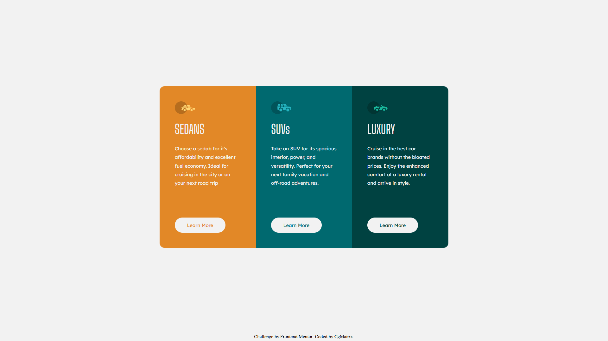

# Frontend Mentor - 3 Column Preview Card Component

This is a solution to the [3 Column Preview Card Component challenge on Frontend Mentor](https://cgmatrix.github.io/frontendmentor.io_3-column-preview-card-component/). Frontend Mentor challenges help you improve your coding skills by building realistic projects.

## Table of contents

- [Overview](#overview)
  - [Welcome](#welcome)   
  - [The challenge](#the-challenge)
  - [Screenshot](#screenshot)
  - [Links](#links)
- [My process](#my-process)
  - [Built with](#built-with)
  - [What I learned](#what-i-learned)
  - [Continued development](#continued-development)
  - [Useful resources](#useful-resources)
  - [AI Collaboration](#ai-collaboration)
- [Author](#author)
- [Acknowledgments](#acknowledgments)

## Overview
### Welcome! 👋

Thanks for checking out this front-end coding challenge.

[Frontend Mentor](https://www.frontendmentor.io) challenges help you improve your coding skills by building realistic projects.
To do this challenge, you need a basic understanding of HTML and CSS.


### The challenge

Your challenge is to build out this 3-column preview card component and get it looking as close to the design as possible.

You can use any tools you like to help you complete the challenge. So if you've got something you'd like to practice, feel free to give it a go.

Your users should be able to:

- View the optimal layout depending on their device's screen size
- See hover states for interactive elements

### Screenshot




### Links

- Live Site URL: [https://cgmatrix.github.io/frontendmentor.io_3-column-preview-card-component/](https://cgmatrix.github.io/frontendmentor.io_3-column-preview-card-component/)

## My process

### Built with:

- Semantic HTML5 markup
- CSS
- Flexbox
- CSS Pseudo-classes
- Mobile-first workflow

### What I learned:

This exercise helped me to improve skills based on:
- CSS flexbox
- Media queries - @media
- Pseudo code - :hover
- Pseudo class - :root
 
This excersize also helped me to re-build skills required for developing a responsive web page by starting with mobile first, desktop second.

Example of code snippest after research on MDN:
```html
 <p class="button button-B">Learn More</p>
```

```css
:root {
  /*CSS Functions*/
  /*VAR()*/

  /*Colors*/
  --gray-100: hsl(0, 0%, 95%);
  --gold-500: hsl(31, 77%, 52%);
  --cyan-800: hsl(184, 100%, 22%);
  --green-950: hsl(179, 100%, 13%);
  --black: hsl(0, 0%, 0%);
}
.button {
  display: flex;
  background-color: var(--gray-100);
  border: 2px solid var(--gray-100);
  margin-top: auto;
  margin-bottom: 0;

  width: 8rem;

  border-radius: 1.5rem;
  padding: 0.75rem;

  justify-content: center;
  align-items: center;
}
.button-B {
  color: var(--green-950);
  font-family: "Lexend Deca", sans-serif;
}

.button-B:hover {
  border: 2px solid var(--gray-100);
  background-color: var(--cyan-800);
  color: var(--gray-100);
  cursor: pointer;
}
```

### Continued development:

Based on extending skills for future projects, I'm planning to focus more on the following:
- CSS Advanced Animations
- SaaS

### Useful resources:

- [MDN Web Docs](https://developer.mozilla.org/en-US/) - This always helped me to regain knowledge of stuff I've forgotten.
- [CSS Tricks](https://css-tricks.com/) - This is an amazing webiste that contains powerfull spreadsheets.
- [CodePen](https://codepen.io/) - An amazing website to study other's code.

### Experience:
Discovering a new technique to optimise code using the CSS var() function placed inside the :root pseudo-class, I helped me to code faster by only updating one area when new values are required, instead of many.

## Author

- Github - [CgMatrix](https://github.com/CgMatrix)
- Frontend Mentor - [@CgMatrix](https://www.frontendmentor.io/profile/CgMatrix)

## Acknowledgments

Big thanks to Frontend Mentor for providing the challenge & design with resources to improve & develop more skills.
